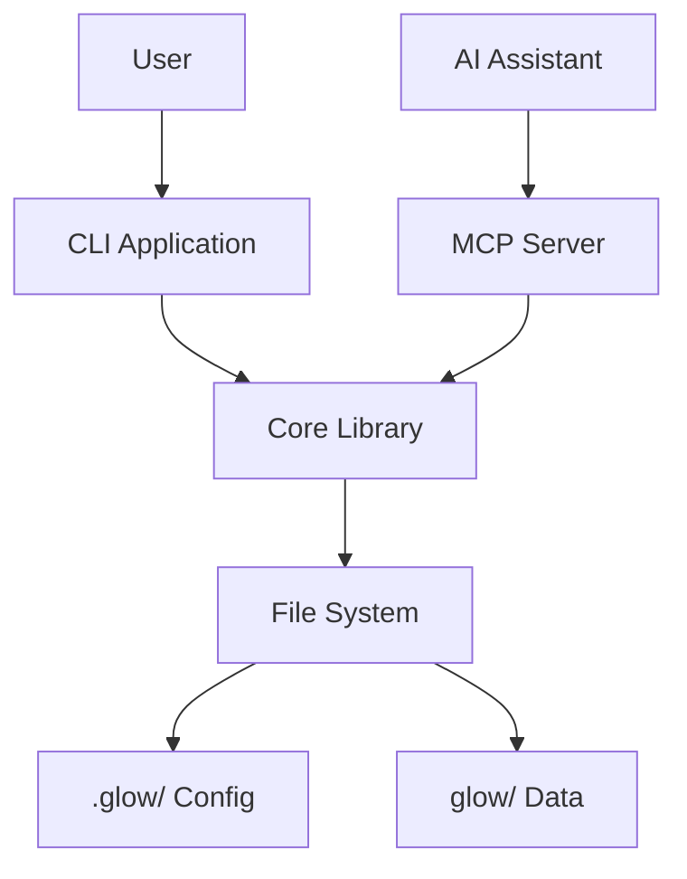
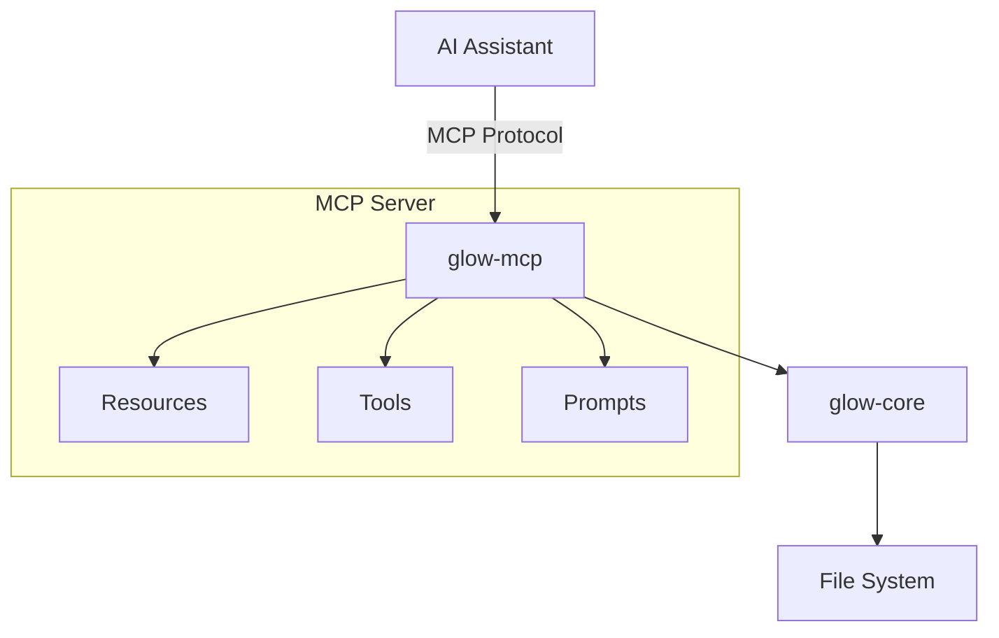

# POC_1 Low-Level Design

## 1. Architecture Overview

The system consists of two main executable components sharing a core library:

1. **CLI Application (`glow`)**: The primary interface for human users to interact with the development process.
2. **MCP Server (`glow-mcp`)**: A Model Context Protocol server that exposes the project context and process tools to AI assistants (e.g., Claude, Copilot).
3. **Core Library (`glow-core`)**: Contains the business logic, data access layer, and process engine.



## 2. Data Model & Storage

> Requirements: POC_1-1.1, POC_1-9

The system follows a "Local-First" and "Git-Friendly" approach. All data (including configuration and process data) is stored in the project repository.

### 2.1. Directory Structure

> Requirements: POC_1-1.1, POC_1-9, POC_1-9.1.1, POC_1-9.2

* `.glow/`: Configuration and definitions.
  * `config.yaml`: General settings (project name, glow config version, data folder, ).
  * `process_config_schema.yaml`.
  * `process_config.yaml`: Definition of the development root process ( steps classification, parameter types, link classification, steps configs ).
  * `templates/`: templates for different step types based on steps classifications.
* `glow/`: Project data (instances of entities).
  * `description.md`: High-level project description.
  * `summary.md`: process summary.
  * `iteration_00000N/` - directory for each process iteration.
    * `artifacts/`: Related files, documents, etc.
    * `summary.md`: Iteration summary.
    * `00N_step-name.md`: Step file.
    * `00N_step-name/`: Additional artifacts or sub-processes for the step.
      * `description.md`: Step description.
      * `summary.md`: Sub-process summary.
      * `iteration_00000N/` - directory for each process iteration.
        * `artifacts/`: Related files, documents, etc.
        * `summary.md`: Sub-process iteration summary.
        * `00N_step-name.md`: Sub-step file.
        * `00N_step-name/`: Additional artifacts or sub-processes for the sub-step.
          * `artifacts/`: Related files, documents, etc.
          * `description.md`: Step description.
          * `summary.md`: Sub-step (as task) summary.

### 2.2. Process Model

> Requirements: POC_1-1.2, POC_1-1.2.1, POC_1-1.3, POC_1-1.5, POC_1-1.6

**Process** is a set of steps with defined relationships and states to be executed in some order.
**Step** is an entity representing a task or (sub-)process. Step is a process if it has process definition (sub-steps), otherwise it's a task.
**Iteration** is a single execution of a process, containing instances of its steps. So process is a cycle of iterations, each iteration is a sequence of steps.
**Link** is an entity co connect Step with other step.
**Classification** is a ordered set of dictionaries defining grouping of steps (or possibly any other subjects) and their predefined attribute values and paramenters (in, out, scope) sets. In subjects classification should be defined as string attribute, containing keys of classification dictionaries in their order, separated by comans. For example, `Feature, Backend` or `Requirement, UI, HighPriority`. This allows to define groups in multiple dimensions. Adress group sets using classification expressions in form of `*,Class1|Class2` to adress all steps with Class1 or Class2 in second classification dictionary, regardless of first dictionary value.
**Parameter** is a named value with defined purpose and type, used as input, output or scope attribute of step execution.
**Stack** is a set of steps from root process to current step, representing context of step execution. Each step in stack represented by it's attributes, but for step-as-process it's scope, in and out parameters are parameters of current iteration.

So project's development process is predefined `Task` "Root Process" for which set of `Steps` are to be defined, which in turn also probably to be processes.

Process root step has no parent, and ID is always `ROOT`.

Step parameter representation has predefined attributes:
**ID**: identifier of parameter in scope of step.
**Purpose**: definition of parameter's purpose (e.g., `Requirement IDs`, `Implementation Link`).
**Data Type**: data type of parameter value
> possible data types:
> scalar: `STR`, `INT`, `DEC`, `BOOL`, `DATE`
> ranged: `RANGE_INT`, `RANGE_DEC`, `RANGE_DATE`
> hierarchical coded set: `SET` (e.g., 1: value1, 1.1: value1.1, 1.2: value1.2, 2: value2)
> content link: `CONTENT` (e.g., link to artefact file with mime-type)
> content template: `TEMPLATE` (string with references to parameters to be rendered by content templating in step description file)
**Prefix**: optional string to prepend to parameter value when rendering.
**isRequired**: boolean flag indicating if parameter is required

Any step execution representation has predefined attributes:

**ID**: identifier of step (e.g., `FEAT-001`, `REQ-002`) in scope of it's parent step.
**FQID**: fully qualified identifier composed of step identifiers from root to curernt step separated by dots (e.g., `FEAT-001.REQ-002.TASK-003`). Root step FQID is always `ROOT`. Root Id is not part of FQID for other steps.
**Purpose**: definition of step's purpose of destiny (e.g., `Feature`, `Requirement`, `Development`).
**Status**: current state of step (e.g., `wait`, `todo`, `in-progress`, `done`).
**Expectations**: criteria to be met to consider step done.
**Classification**: string representing step classification
**Parent**: Representation of parent step's current iteration scope including it's own parent until root. Represents execution stack.
**Steps**: For step-as-process, representation of sub-steps representations in current iteration, with links.
**Inputs**: A set of input parameters for step execution configured for step. Used to control possible status.
**Outputs**: A set of output parameters produced by step execution configured for step. Allows to map to context (inputs, scope and parent parameters) *sic!
**Scope**: A set of parameters defined in step-as-task or in step-as-process-iteration set on initialization and added while in process, configured or not. Can be inferred from context using templates*sic!
**Links**: a set of links to other steps in process with status.

Context emerges as union of parameters in iteration Inputs, Scope, Stack, and scopes of own (for step-as-process).
Inputs are prepared from linked done dependencies outputs.

Any link representation has predefined attributes:

**type**: link type (`dependency`, `predecessor`).
**step**: step ID.
**linked_step**: linked step ID.

Steps can be linked only in bounds of parent process.
Linked steps must not form closed loops.

## 3. Configuration

> Requirements: POC_1-1, POC_1-1.1, POC_1-2.2, POC_1-2.2.1, POC_1-2.2.2

Default configuration folder: `.glow/`.
Configuration folder might be redefined by `DEV_GLOW_CONFIG_DIR` environment variable, or CLI option `--config-dir <path>`.

Configuration file : `config.yaml`.

Config folder and file must be created by `glow project init` command if not exist.

Configuration file must define general settings:

* data folder name (default: `glow/`).
* process configuration file name (default: `process_config.yaml`).
* templates folder name (default: `templates/`).
* default step template file name (default: `any-step.{TODO}`).

Process configuration file must be created by `glow project init` command if not exist.

Default process configuration file must contain:

* process root step definition, ready to be filled by steps configurations.
* empty classifications definitions.
* empty parameter types definitions.

## 4. Templating

> Requirements: POC_1-1.4, POC_1-9.1.4, POC_1-9.1.5

Purpose:

1. **data-file template** to render step data files.
    * by default temlate data-file is markdown with YAML Frontmatter, and default template file for any step is to render such files.
    * for this reason all required data must be available at render time.
    * default template file for any step must be created by `glow project init` command if not exist.
2. **content template** to render task description file.
    * step data file content after fromtmatter serves as template for task description file, it holds text with references to step inputs, scope, stack parameters, own steps (for step-as-process).

So there 2 types of templates:

* step data file template.
* task description file template.

Templates folder must be created by `glow project init` command if not exist.

### 4.1. Data-file templating to render data files

> Requirements: POC_1-1.4, POC_1-9.1.4, POC_1-9.1.5, POC_1-9.1.6

There are few predefined placeholders should be available for templates rendering:

* step attributes:
  * id, fqid, classification, purpose, status, expectations
  * each holds value of step attribute.
  * `{{attr.id}}`, ...
* step parameters:
  * inputs: input parameters with their values. - holds array of input parameters {id, value} pairs.
  * scope: scope parameters with their values. - holds array of scope parameter {id, value} pairs.
  * `{{inputs[0].id}}: {{inputs[0].value}}`, `{{scope[0].id}}: {{scope[0].value}}`, ...
* parent stack:
  * parent and parent's parent up to root. - array of steps {id, steps: {id, status}[]}.
  * `{{parents[0].id}}`, `{{parents[0].steps[0].id}}`
* own steps (for step-as-process) (no recursion).
  * array of steps {id, status}.
  * `{{own_steps[0].id}}`, ...
* links: linked steps.
  * array of linked step {step-id,link-type,step-status} objects.
  * `{{links[0].step_id}}`, ...

Templates can reference step attributes and parameters using placeholders.

Default template should render all available placeholders as frontmatter, and empty content.

Customized templates per classification group can be created by user to render data file differently or with additional content.

### 4.2. Content Templating to render task description files

> Requirements: POC_1-9.1.6, POC_1-9.1.7, POC_1-9.1.8, POC_1-9.1.9

Task description file is to be rendered when all parameters reacheable in step context have values, this should be same condition as when step is moved to `todo`, so references to parameters in data file content can be resolved.

So data-file content after frontmatter can hold references to:

* step parameters:
  * attributes: {[id]: value}
  * input - map of input parameters {[id]: value}
  * scope - map of scope parameters {[id]: value}
  * `input.REQUIREMENTS`, `scope.IMPLEMENTATION_LINK`, `attr.ID`, ...
* parent:
  * chained parents: {[parent_id]: {input: {[id]: value}, scope: {[id]: value}}, steps: {[step_id]: {input, scope}}}
  * `parent.DEVELOPMENT.scope.IDEA_LINK`, `parent.FEAT-001.steps.REQ-002.input.REQ_CLARIFICATIONS`, ...
* own steps (for step-as-process):
  * own steps in current iteration: {[step_id]: {input: {[id]: value}, scope: {[id]: value}}}
  * `own_steps.TASK-001.scope.IMPLEMENTATION_LINK`, ...
* linked steps parameters: {[step_id]: {input: {[id]: value}, scope: {[id]: value}}}
  * `links.FEAT-001.input.REQ_LIST`, ...

It is a **content template**.

So description file content is same as data file content but with references replaces by actual values.

CONTENT type parameter value is a link to artefact file, so when rendering such parameter in template, it should be rendered as markdown link with title and url to artefact file. Content can be stoered in separate file in artefacts folder so link url is relative path to that file from description file, or explicit url to external resource.

TEMPLATE type parameter value is a string with references to parameters replaced by actual values - so when rendering such parameter in template, it should be rendered first (recursively) as content template.

SET parameters can be referenced with selectors to pick subsets of code-values.

Scalar and ranged parameters are rendered as is.

Content templates can be used as parameters-mapping linking paramrters and (including subsets) between different steps if their references placed in tables or lists of pairs or any other structured way.

### 4.3 Templating Engine

> Requirements: POC_1-1.4

Use `handlebars` crate as templating engine.

In data-file template references to parameters and attributes which are to be passed as content template should not be placed inside placeholders `{{}}`, other way to pass content-template placeholders is to use raw blocks `{{{{raw}}}}...{{{{/raw}}}}` or escape `\\{{...}}`.
After rendering data-file template, the content part should be processed to detect references and put thim in placeholders.

### 4.4. Subset picking syntax for SET parameters

> Requirements: POC_1-1.6.1

Purpose: allow to pick subsets of SET parameters, which are hierarchical coded lists.

Features:

1. composable selection to pick on multiple levels.
2. range selection to pick on ranges of codes on same level with inclusive and exclusive bounds.
3. enumeration selection to pick specific codes on level.
4. exclusion selection to exclude codes on level.
5. regex templates to pick codes matching regex on level.

Syntax:

Custom handlebars helper to pick subsets of SET parameters

`{{subset param_ref ":selector1:selector2:...:selectorN"}}`

Reference to SET parameter with selector in data-file template (without placeholders)

`param_ref:selector1:selector2:...:selectorN`

Where each selector can be:

* `:` - level selector indicator.
* `:!` - exclusion level selector indicator.
* `:+` - additive level selector indicator - kees previous selection results.
* `[start-end)` - range to pick codes from start to end on level.
* `(start-]` - range to pick codes from start to last on level.
* `[-end]` - range to pick codes from first to end on level.
on level.
* `code1,code2<subselector>,...` - enumeration to pick specific code on level with individual subselectors.
* `/repattern/i` - regex template to pick codes matching repattern on level (with options).

selectors are applied in order from first to last, each selector applies to result of previous selector.

Example:

> 1 value1
> 1.Q-1 value1.1
> 1.Q-2 value1.2
> 2 value2
> 2.Q-2 value2.1
> 2.Q-3.1 value2.1.1
> 2.Q-4 value2.2
> 3 value3
> 4 value4

`LIST_PARAM:1,2<Q-3->,4:Q-2,Q-3`

picks `1 value1`, `1.Q-2 value1.2`, `2 value2`, `2.Q-3.1 value2.1`

`LIST_PARAM:1,2<Q-3->,4:+Q-2,Q-3`

picks `1 value1`, `1.Q-2 value1.2`, `2 value2`, `2.Q-3.1 value2.1`, `4 value4`

1. `1,2<Q-3->,4` - pics 1 and 4 with all subcodes, and 2 with subcodes from Q-3 to last
2. `Q-2,Q-3` - from previous result picks only subcodes Q-2 and Q-3, parents are kept, but other parent levels are removed.
3. `:+` - keeps previous result and adds new selection

### 4.5. Example

> Requirements: POC_1-1.4, POC_1-9.1.4, POC_1-9.1.5

`.glow/templates/important_step.md`

```markdown
---
attr:
  id: {{attr.id}}
  fqid: {{attr.fqid}}
  classification: {{attr.classification}}
  purpose: {{attr.purpose}}
  expectations: {{attr.expectations}}
  status: {{attr.status}}
input: 
  
  - id: {{inp.id}}
    value: {{inp.value}}
  
scope: 
  
  - id: {{scp.id}}
    value: {{scp.value}}
  
parent:
  
  - id: {{par.id}}
    steps:
      
      - id: {{step.id}}
        status: {{step.status}}
      
  
own_steps:
  
  - id: {{ost.id}}
    status: {{ost.status}}
  
links:
  
  - step_id: {{lnk.step_id}}
    link_type: {{lnk.link_type}}
    step_status: {{lnk.step_status}}
  
---

# Description content with references:

- Input Requirement IDs: input.REQUIREMENTS
- Scope Implementation Link: scope.IMPLEMENTATION_LINK
- Parent Development Idea Link: parent.DEVELOPMENT.scope.IDEA_LINK
- Own Step Task-001 Implementation Link: own_steps.TASK-001.scope.IMPLEMENTATION_LINK
- Linked Feature Requirement List: links.FEAT-001.input.REQ_LIST:[1-5]
```

 `glow/iteration_000001/001_important_step.md`

```markdown
---
attr:
  id: 001
  fqid: FEAT-001.001
  classification: Feature, Backend
  purpose: Important Feature
  expectations: Implemented and tested
  status: todo
input: 
  - id: REQUIREMENTS
    value: REQ-001,REQ-002,REQ-003
scope: 
  - id: IMPLEMENTATION_LINK
    value: ./artifacts/implementation_plan.md
parent:
  - id: FEAT-001
    steps:
      - id: REQ-001
        status: done
      - id: REQ-002
        status: in-progress
      - id: REQ-003
        status: todo
own_steps:
  - id: TASK-001
    status: todo
links:
  - step_id: FEAT-001
    link_type: dependency
    step_status: in-progress
---

# Description content with references:

- Input Requirement IDs: input.REQUIREMENTS
- Scope Implementation Link: scope.IMPLEMENTATION_LINK
- Parent Development Idea Link: parent.DEVELOPMENT.scope.IDEA_LINK
- Own Step Task-001 Implementation Link: own_steps.TASK-001.scope.IMPLEMENTATION_LINK
- Linked Feature Requirement List: links.FEAT-001.input.REQ_LIST:[1-5]
```

`glow/iteration_000001/001_important_step/description.md`

```markdown

# Description content with references:

- Input Requirement IDs: REQ-001,REQ-002,REQ-003
- Scope Implementation Link: [????](./artifacts/implementation_plan.md)
- Parent Development Idea Link: [???](../artifacts/idea_description.md)
- Own Step Task-001 Implementation Link: [????](./Task-001/artifacts/implementation_details.md)
- Linked Feature Requirement List: [REQ-001:fsdfdsfs, REQ-002:fdgjwiofjofjwe, REQ-003: efwnfwjfowjfwo, REQ-004: fewfwfwuij, REQ-005: fdogdnwfndwfmdwkflmkdwl] 
```

## 5. Operations

### 5.1. Init Project

> Requirements: POC_1-2, POC_1-2.1, POC_1-2.2, POC_1-2.2.1, POC_1-2.2.2

Purpose: initialize project structure in current directory.

`glow project init` - initializes folders and configuration files in current directory if not exist.

### 5.2. Init step (process cycle)

> Requirements: POC_1-5, POC_1-5.1, POC_1-5.2

Purpose: Initialize step, provide required scope parameters, create or update related files and folders, update statuses.

`glow init <step-fqid> [--new] [scope_param]...` - initializes step by given FQID `step-fqid`.

`step-fqid` is required. If step is root process, `step-fqid` is `ROOT`.

`--new` is optional, if provided, initializes new iteration of step-as-process if it is allowed (i.e. curent is done).

`scope_param` for each parameter in step's scope must be provided as `--param_name=param_value`. For CONTENT type parameters, `param_value` is path to artefact file or uri. When path is provided, artefact file is copied to step's artefacts folder.

If step to initialize is not found, or required scope parameters are not provided, command fails.

if step is in `wait` status and there are unfinished dependencies, command fails.

expected result:

for step-as-process:

if no --new provided and step is in `in-progress` status, asks if start new iteration, if confirmed, continues as with --new.

1. step's data-file updated to set status to `in-progress` if it was `todo`.
2. step's description file.
3. new iteration folder in step's folder, with summary file.
4. for each sub-step in step's process definition:
   * new step file (and folder if needed) in iteration folder, with configured parameters rendered from template.
   * if sub-step has no dependencies and scope parameters to set, set status to `todo`, otherwise `wait`.

for step-as-task:

1. step file rendered from template with provided scope parameters and configured inputs.
2. step's description file.
3. if step has no undone dependencies and scope parameters to set, set status to `todo` and description file is rendered from data file content, otherwise `wait`.

### 5.3. Start Task Step

> Requirements: POC_1-6, POC_1-6.1, POC_1-6.2

Purpose: Move step-as-task to `in-progress` status, rerender data-file from template with prepared context, update parent iteration summary.

`glow start <step-fqid>` - moves step-as-task to `in-progress` status.

If step is not found, or not a task, or not in `todo` status, command fails.

Expected result:

1. step's data-file updated to set status to `in-progress`.
2. step's data-file rerendered from template.
3. step's description file rerendered from data-file content.
4. parent process step's iteration summary updated.
5. step's summary description updated

### 5.4. Finish Task Step

> Requirements: POC_1-7, POC_1-7.1, POC_1-7.2, POC_1-7.3

Purpose: Move step-as-task to `done` status, create configured outputs, append summary to content, update parent iteration.

`glow finish <step-fqid> [output-param]... [summary]` - moves step-as-task to `done` status.

If step is not found, or not a task, or not in `in-progress` status, command fails.

`output-param` for each output parameter in step's configuration must be provided as `--param_name=param_value`.

if there unfilled output parameters, command fails.

Expected result:

1. step's data-file updated to set status to `done`.
2. step's content appended with provided summary.
3. step's outputs set in data-file.
4. parent process step's iteration summary updated.
5. parent process step's iteration recheck for dependent steps to move from `wait` to `todo`.
6. if all sub-steps are done, parent process step's iteration set to `done`.

### 5.5. Get current project status

> Requirements: POC_1-3, POC_1-3.1, POC_1-3.2

Purpose: Display current project status in tree view, highlighting active items.

`glow status [--list] [--attrs=ATTRIBUTES] [--highlight=STATUSHIGHLIGHT] [--filter=FILTER]` - displays current project status.

* ATTRIBUTES:
  * comma-separated list of step attributes to display (e.g., `id,status,purpose`).
  * default: `id,status,purpose`.
* STATUSHIGHLIGHT:
  * comma-separated list of statuses to highlight (e.g., `bold:in-progress,todo;italic:wait`).
  * default: `bold:in-progress,todo;italic:wait`.
  * format: `STYLE:STATUS1,STATUS2;STYLE2:STATUS3,...`
  * supported styles: `bold`, `italic`.
* FILTER:
  * filter expression to display only matching steps (e.g., `status==todo && classification==Feature && parent==REQ-001`).
  * default: no filter.
  * supported operators: `==`, `&&`
  * status expression: coma-separated list of statuses (e.g., `in-progress,todo`, `done`).
  * classification expression: string with classification keys separated by commas, each key can be classKey or `*` or multiple values separated by `|` (e.g., `Feature,Backend|Frontend,*`).

Expected result:

1. tree view of current project steps.
2. list view if --list provided. list view is flat list of steps with full FQID.
3. highlight steps matching STATUSHIGHLIGHT.
4. only steps matching FILTER.

### 5.6. Get recommended next actions

> Requirements: POC_1-4

Purpose: Suggest next actions based on current project status and process model.

`glow next` - suggests next actions.

Expected result:

1. list of recommended next actions (e.g., "You have 3 open tasks", "You can start REQ-002").

### 5.7. Get Progress Metrics

> Requirements: POC_1-8, POC_1-8.1

Purpose: Display overall progress metrics for the current project.

`glow progress [--format=text|json]` - displays progress metrics.

Expected result:

1. Total steps count by status (wait, todo, in-progress, done).
2. Completion percentage per process level.
3. Steps with blocking dependencies.

### 5.8. Show Step Details

> Requirements: POC_1-3, POC_1-3.2, POC_1-6.1

Purpose: Display detailed information about a specific step including context.

`glow show <step-fqid>` - shows step details.

Expected result:

1. Actions same as starting step, except status not checked nor changed.
2. Return:
   * data-file.
   * description file if possible to render.
   * summary file.

### 5.10. Validate Context Quality

TODO: AI generated. Work through and adjust as needed.

> Requirements: POC_1-10, POC_1-10.1, POC_1-10.2, POC_1-10.3

Purpose: Assess context quality based on completeness, consistency, and semantic connection.

`glow validate [step-fqid] [--fix]` - validates context quality.

If `step-fqid` is not provided, validates entire project.

Expected result:

1. Report on context completeness:
   * Missing required parameters.
   * Unfilled inputs for steps ready to start.
2. Report on context consistency:
   * Conflicting parameter values across steps.
   * Orphaned references (links to non-existent steps).
3. Report on semantic connection:
   * Unlinked steps that should be connected.
   * Broken traceability chains.
4. If `--fix` is provided, attempt automatic fixes where possible.

## 6. Configuration File Schemas

> Requirements: POC_1-1.1, POC_1-1.2, POC_1-1.6

### 6.1. Schema Validation Approach

Configuration files are validated using **JSON Schema (Draft-07)**. This approach provides:

1. **YAML Compatibility**: YAML 1.2 is a superset of JSON, so JSON Schema validates YAML directly.
2. **IDE Integration**: VS Code and other editors provide autocomplete, hover docs, and inline validation via YAML Language Server.
3. **Rust Tooling**:
   * `schemars` crate generates schemas from Rust structs (single source of truth).
   * `jsonschema` crate provides runtime validation with detailed error messages.
4. **Human-Readable Errors**: Schema validation produces actionable error messages for users.

### 6.2. Schema Files

Schemas are located in `.glow/schemas/` (shipped with glow) and referenced in YAML files.

| Schema File | Validates | Description |
|-------------|-----------|-------------|
| [config.schema.json](schemas/config.schema.json) | `.glow/config.yaml` | General project settings: data folder, template locations |
| [process_config.schema.json](schemas/process_config.schema.json) | `.glow/process_config.yaml` | Process definition: steps, classifications, parameters, links |
| [mcp_config.schema.json](schemas/mcp_config.schema.json) | `.glow/mcp_config.yaml` | MCP server settings: resources, tools, prompts (optional) |
| [step_data.schema.json](schemas/step_data.schema.json) | `glow/**/*.md` frontmatter | Step data file structure: attributes, parameters, context |

### 6.3. Schema Usage

TODO: AI generated. Work through and adjust as needed.

#### 6.3.1. IDE Integration

YAML files reference schemas for editor support:

```yaml
# .glow/config.yaml
# yaml-language-server: $schema=./schemas/config.schema.json
version: "0.1.0"
project_name: "My Project"
data_folder: "glow/"
```

#### 6.3.2. Runtime Validation

CLI validates on load with user-friendly errors:

```
ERROR [CONFIG_ERROR]: Invalid process_config.yaml
  At path: $.root_process.steps[0].inputs[0]
  Message: Missing required property 'id'
  
  Suggestion: Each input parameter must have an 'id' field.
```

### 6.4. Schema Design Notes

| Schema | Key Design Decisions |
|--------|---------------------|
| **config** | Minimal required fields; sensible defaults for quick start |
| **process_config** | Recursive `StepDefinition` supports arbitrary nesting; `$defs` for reuse |
| **mcp_config** | Entirely optional; allows granular control over AI access |
| **step_data** | Mirrors template output structure; supports all data types from Section 11 |

### 6.5. Validation Timing

Each time configuration file is loaded or saved.
Each time step data file is loaded or saved.

## 7. Context Quality Assessment

TODO: AI generated. Work through and adjust as needed.

> Requirements: POC_1-10, POC_1-10.1, POC_1-10.2, POC_1-10.3

### 7.1. Completeness Assessment

> Requirements: POC_1-10.1

Context completeness is evaluated based on:

1. **Required Parameters**: All `is_required: true` parameters must have values.
2. **Input Availability**: For steps in `todo` status, all inputs must be resolvable from context.
3. **Output Mapping**: For steps in `done` status, all outputs must be set and mapped.

Completeness score calculation:

```
completeness = (filled_required_params / total_required_params) * 100
```

Levels:

* **Complete**: 100% - all required parameters filled
* **Sufficient**: ≥80% - most parameters filled, can proceed
* **Insufficient**: <80% - missing critical context

### 7.2. Consistency Assessment

> Requirements: POC_1-10.3

Context consistency is evaluated based on:

1. **Reference Validity**: All step/parameter references resolve to existing entities.
2. **Value Coherence**: Linked parameters have compatible values.
3. **Status Logic**: Step statuses align with dependency states.

Consistency checks:

* No orphaned links (links to non-existent steps).
* No circular dependencies.
* Parameter mappings resolve correctly.
* Status transitions are valid.

### 7.3. Semantic Connection Assessment

> Requirements: POC_1-10.2

Semantic connection evaluates traceability:

1. **Upward Traceability**: Steps link back to parent goals/requirements.
2. **Downward Traceability**: Requirements decompose into implementation steps.
3. **Horizontal Traceability**: Related steps are properly linked.

Connection score based on:

* Percentage of steps with proper parent references.
* Percentage of requirements with linked implementations.
* Coverage of semantic links across process phases.

### 7.4. Quality Gates

> Requirements: POC_1-10, POC_1-10.1, POC_1-10.3

Quality gates are checkpoints enforced at step transitions:

| Transition | Gate Checks |
|------------|-------------|
| wait → todo | All dependencies done, required inputs available |
| todo → in-progress | Step data file rendered, description available |
| in-progress → done | All outputs filled, summary provided |
| iteration complete | All sub-steps done, iteration summary complete |

## 8. MCP Server Design

TODO: AI generated. Work through and adjust as needed.

> Requirements: POC_1-11

### 8.1. MCP Server Architecture

> Requirements: POC_1-11

The MCP server (`glow-mcp`) exposes the project context and process tools to AI assistants.



### 8.2. MCP Resources

> Requirements: POC_1-11, POC_1-3.2

Resources expose project data for AI context:

| Resource URI | Description |
|--------------|-------------|
| `glow://project/status` | Current project status summary |
| `glow://project/context` | Full project context tree |
| `glow://step/{fqid}` | Step details with context |
| `glow://step/{fqid}/description` | Rendered step description |
| `glow://step/{fqid}/context` | Step context stack |
| `glow://iteration/{fqid}` | Iteration summary and steps |
| `glow://config/process` | Process configuration |
| `glow://config/classifications` | Available classifications |

### 8.3. MCP Tools

> Requirements: POC_1-11

Tools enable AI to perform process actions:

| Tool Name | Description | Parameters |
|-----------|-------------|------------|
| `glow_status` | Get current project state | `format: "tree"/"list"/"summary"`, attributes?: string, highlight?: string, filter?: string |
| `glow_next` | Get recommended next actions | - |
| `glow_show_step` | Show step details | `fqid: string, include_context: bool` |
| `glow_start_step` | Start a task step | `fqid: string` |
| `glow_finish_step` | Finish a task step | `fqid: string, outputs: object, summary: string` |
| `glow_validate` | Validate context quality | `fqid?: string` |
| `glow_progress` | Get progress metrics | - |

### 8.4. MCP Prompts

> Requirements: POC_1-11

Pre-defined prompts for common AI assistance patterns:

| Prompt Name | Description |
|-------------|-------------|
| `task_context` | Prepare context for working on a specific task |
| `review_step` | Review step completion and quality |
| `suggest_breakdown` | Suggest task breakdown for a process step |
| `analyze_blockers` | Analyze and suggest solutions for blocked steps |

### 8.5. MCP Server Configuration

> Requirements: POC_1-11, POC_1-1.1

```yaml
# .glow/mcp_config.yaml (optional)
server:
  name: "glow-mcp"
  version: "0.1.0"
  
resources:
  expose_artifacts: true          # Include artifact file contents
  max_context_depth: 5            # Max depth for context tree
  
tools:
  require_confirmation:           # Tools requiring user confirmation
    - glow_finish_step
    - glow_init
  read_only_mode: false           # If true, disable write operations

prompts:
  custom_prompts_folder: "prompts/"  # Folder for custom prompt templates
```

## 9. AI Integration Points

TODO: AI generated. Work through and adjust as needed.

> Requirements: POC_1-11

### 9.1. Context Preparation for AI

> Requirements: POC_1-11, POC_1-6.1

When preparing context for AI assistance (via MCP or CLI):

1. **Task Context Extraction**: Gather relevant context for specific task.
2. **Token Optimization**: Prioritize recent and directly relevant information.
3. **Structure Formatting**: Format as structured data (YAML/JSON) for AI consumption.

### 9.2. AI-Assistable Operations

> Requirements: POC_1-11

| Operation           | AI Role           | Human Role            |
|---------------------|-------------------|-----------------------|
| Task breakdown      | Suggest sub-tasks | Review and approve    |
| Description writing | Draft description | Review and edit       |
| Context validation  | Identify issues   | Decide on fixes       |
| Progress reporting  | Generate summary  | Verify accuracy       |
| Dependency analysis | Suggest links     | Confirm relationships |

### 9.3. Copilot Integration

> Requirements: POC_1-11

`.github/copilot-instructions.md` can reference glow context:

```markdown
## Project Context

This project uses dev-glow for process management.
Current status: Use `glow status` to see project state.

When implementing tasks:
1. Check task context: `glow show <task-fqid>`
2. Follow expectations defined in the task
3. Update outputs when complete: `glow finish <task-fqid>`
```

## 10. Error Handling

TODO: AI generated. Work through and adjust as needed.

> Requirements: (Design extension - no direct requirement)

### 10.1. Error Categories

> Requirements: (Design extension - no direct requirement)

| Category           | Description                 | Exit Code |
|--------------------|-----------------------------|-----------|
| `CONFIG_ERROR`     | Configuration file issues   | 1         |
| `VALIDATION_ERROR` | Data validation failures    | 2         |
| `STATE_ERROR`      | Invalid state transitions   | 3         |
| `NOT_FOUND`        | Entity not found            | 4         |
| `IO_ERROR`         | File system errors          | 5         |

### 10.2. Error Response Format

> Requirements: (Design extension - no direct requirement)

CLI errors display:

1. Error category and code.
2. Human-readable message.
3. Suggested action to resolve.
4. Reference to relevant documentation.

Example:

```
ERROR [STATE_ERROR]: Cannot start step 'TASK-001'
  Step is in 'wait' status with unfinished dependencies.
  
  Blocking dependencies:
    - REQ-001 (status: in-progress)
    - REQ-002 (status: todo)
  
  Suggestion: Complete blocking dependencies first, or use 'glow next' to see available actions.
```

### 10.3. Validation Rules

> Requirements: POC_1-10, POC_1-1.5

| Rule               | Description                                               |
|--------------------|-----------------------------------------------------------|
| `UNIQUE_ID`        | Step IDs must be unique within parent scope               |
| `VALID_LINK`       | Links must reference existing steps within same iteration |
| `NO_CYCLES`        | Dependency chains must not form cycles                    |
| `REQUIRED_PARAMS`  | Required parameters must have values before transition    |
| `VALID_STATUS`     | Status transitions must follow allowed paths              |

## 11. Data Types Specification

> Requirements: POC_1-1.6, POC_1-1.6.1

### 11.1. Scalar Types

> Requirements: POC_1-1.6.1

| Type   | Description    | Example                 |
|--------|----------------|-------------------------|
| `STR`  | String value   | `"Feature description"` |
| `INT`  | Integer number | `42`                    |
| `DEC`  | Decimal number | `3.14`                  |
| `BOOL` | Boolean        | `true` / `false`        |
| `DATE` | ISO date       | `"2025-01-08 00:00:00"` |

### 11.2. Range Types

> Requirements: POC_1-1.6.1

| Type         | Description   | Example                        |
|--------------|---------------|--------------------------------|
| `RANGE_INT`  | Integer range | `[1, 100]`                     |
| `RANGE_DEC`  | Decimal range | `[0.0, 1.0]`                   |
| `RANGE_DATE` | Date range    | `["2025-01-01", "2025-03-31"]` |

### 11.3. Complex Types

> Requirements: POC_1-1.6.1

#### 11.3.1. SET

Hierarchical coded set - tree structure of codes with values.

List of code - value pairs, with hierarchy indicated by dot notation in codes.

Subset picking syntax supported in templating (see Section 4.4).

Can be stored as YAML flat list.
Can be rendered as markdown list or table.

#### 11.3.2. CONTENT

Link to artifact file or resource with mime type.

Can be stored as object with `uri` and `mime` fields.

For files stored in artefacts folder, `uri` is relative path to file from step's description file.

For external resources, `uri` is full URL.

Can be stored as YAML object.
Can be rendered as markdown link with title and url to artifact file.

#### 11.3.3. TEMPLATE

Templated string with parameter refs.

`"See {{parent.scope.DESIGN_DOC}}"`

## 12. File Naming Conventions

TODO: AI generated. Work through and adjust as needed.

> Requirements: POC_1-9.1, POC_1-9.2

### 12.1. Step Data File

> Requirements: POC_1-9.1, POC_1-9.1.2

Keep step files named align with step identifiers for easy mapping.

### 12.2. Step Folders

> Requirements: POC_1-9.1.1, POC_1-9.2

step folder name must be same as step data file name.

### 12.3. Iteration Folders

> Requirements: POC_1-9.2, POC_1-1.2

Pattern: `iteration_{N}/` where N is 6-digit padded number.

Examples:

* `iteration_000001/`
* `iteration_000002/`

## 13. Implementation Notes

TODO: AI generated. Work through and adjust as needed.

> Requirements: (Design extension - no direct requirement)

### 13.1. Technology Stack

> Requirements: (Design extension - no direct requirement)

* **Language**: Rust
* **CLI Framework**: `clap` for argument parsing
* **Templating**: `handlebars` crate
* **Configuration**: `serde_yaml` for YAML parsing
* **MCP Server**: Custom implementation following MCP specification
* **File Watching**: `notify` crate for file system events (optional)

### 13.2. Core Library Structure

> Requirements: (Design extension - no direct requirement)

```
glow-core/
├── src/
│   ├── lib.rs
│   ├── config/          # Configuration loading and validation
│   ├── model/           # Data model structs
│   │   ├── step.rs
│   │   ├── process.rs
│   │   ├── parameter.rs
│   │   └── link.rs
│   ├── engine/          # Process engine
│   │   ├── state.rs     # State machine
│   │   ├── context.rs   # Context management
│   │   └── validation.rs
│   ├── storage/         # File system operations
│   ├── template/        # Templating engine wrapper
│   └── quality/         # Context quality assessment
```

### 13.3. CLI Application Structure

> Requirements: POC_1-2, POC_1-3, POC_1-4, POC_1-5, POC_1-6, POC_1-7, POC_1-8

```
glow-cli/
├── src/
│   ├── main.rs
│   ├── commands/
│   │   ├── init.rs
│   │   ├── start.rs
│   │   ├── finish.rs
│   │   ├── status.rs
│   │   ├── next.rs
│   │   ├── show.rs
│   │   ├── list.rs
│   │   ├── validate.rs
│   │   └── progress.rs
│   └── output/          # Formatting for terminal output
```

### 13.4. MCP Server Structure

> Requirements: POC_1-11

```
glow-mcp/
├── src/
│   ├── main.rs
│   ├── server.rs        # MCP protocol handler
│   ├── resources/       # Resource handlers
│   ├── tools/           # Tool implementations
│   └── prompts/         # Prompt templates
```

## 14 Summaries

TODO: Investigate context assesment, maintenance and evolution questions and ways to address or improve them.

At the moment, summary use cases are not clear and consists of:

1. there is summary file in each step folder and iteration folder.
2. finishing step allows to commit summary.
3. summary file content should be updated when step is finished or iteration is finished.

No exact purpose, logic, format or structure defined yet.

This is entirely open for further investigation and definition during POC_1 implementation and evaluation.

## 15 History

TODO: investigate project logging questions.

At the moment, no logging or history tracking defined.

`glow progress` command provides current status snapshot, but no time metrics or history.

This is entirely open for further investigation and definition during POC_1 implementation and evaluation.